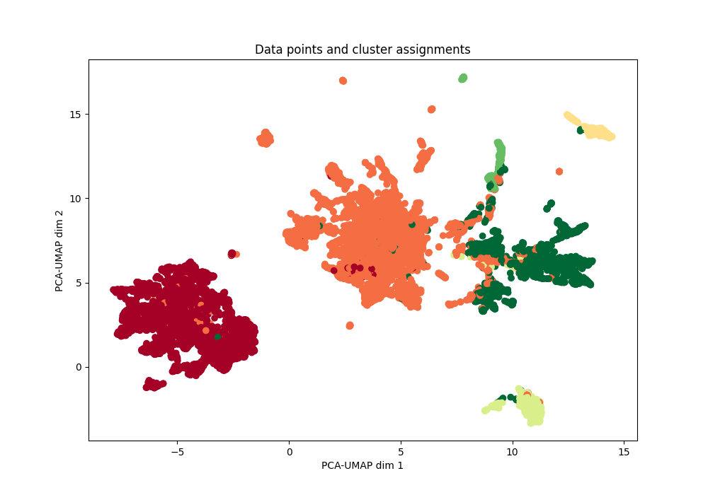
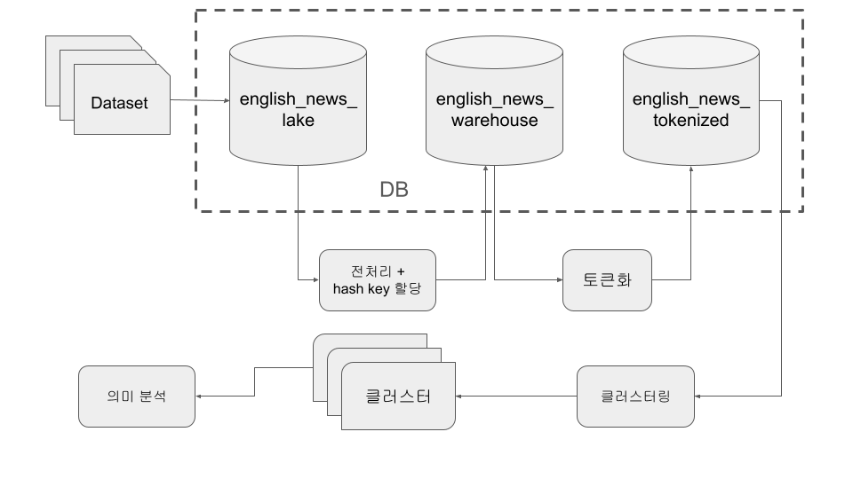
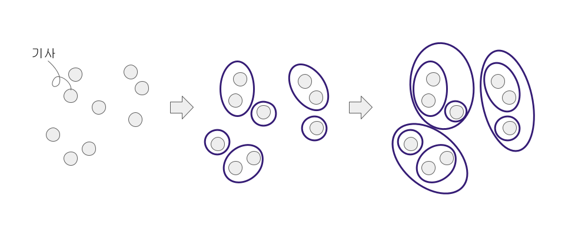
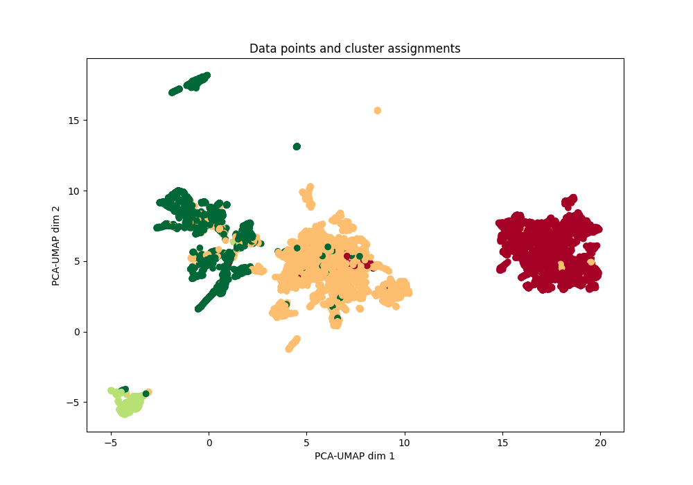

# 네이버 뉴스 클러스터링 알고리즘 역공학 및 의미 분석


## 프로젝트 개요

본 프로젝트는 네이버 뉴스 서비스에서 사용 중인 [뉴스 클러스터링 알고리즘](https://media.naver.com/algorithm)을 역공학한 후, 이를 Kagge 영어 뉴스 도메인에 적용하여 기사 분류를 시행합니다. 최종적으로 각 클러스터 별로 LDA 및 TF-IDF 의미 분석을 시행하여 각 클러스터 별로 어떤 의미를 담고 있는지를 그리고 어떤 기준으로 군집을 생성하였는지를 살펴봅니다.


## Dataset
본 프로젝트의 데이터셋은 Kaggle 영어 뉵스 데이터셋을 사용하였으며, 기사 본문, 기사 제목, 작성일과 출처가 포함되여 있습니다.

#### Source: [BBC News Articles](https://www.kaggle.com/datasets/bhavikjikadara/bbc-news-articles)
- **Attributes Used:** Description text
#### Source: [Space News Dataset](https://www.kaggle.com/datasets/patrickfleith/space-news-dataset)
- **Attributes Used:** Content text

## 설치
To run this project, follow these steps:

1. Clone the repository:
    ```bash
    git clone https://github.com/yourusername/news-clustering-lda.git
    cd news-clustering-lda
    ```
2. Create and activate a virtual environment:
    ```bash
    python -m venv venv
    source venv/bin/activate   # On Windows, use `venv\Scripts\activate`
    ```
3. Install the required packages:
    ```bash
    pip install -r requirements.txt
    ```

## 적용법
1. **Preprocess the Data:**
    ```bash
    python preprocess.py
    ```
2. **Vectorize using TF-IDF:**
    ```bash
    python vectorize.py
    ```
3. **Perform Hierarchical Clustering:**
    ```bash
    python cluster.py
    ```
4. **Topic Modeling with LDA:**
    ```bash
    python lda.py
    ```
5. **Visualize Results:**
    ```bash
    python visualize.py
    ```

## 진행 과정



#### 1. Data Preprocessing:
- 토큰화에 필요한 단어 추출을 위해 원시 데이터 전처리 (removing stopwords, punctuation, etc.)
  | - | 단계 | 예시 |
  |:---:|:---:|:---:|
  | 0 | 데이터 선택 | \tThe US Bank loses 1.3M $, almost 2%\n. |
  | 1 | 소문자화 | \tthe us bank loses 1.3m $, almost 2%\n. |
  | 2 | % 기호 변환 | \tthe us bank loses 1.3m $, almost 2percent\n. |
  | 3 | 통화 변환 | \tthe us bank loses 1.3m dollar, almost 2percent\n. |
  | 4 | escape 문자 제거 | the us bank loses 1.3m dollar, almost 2percent. |
  | 5 | 숫자, 영어 띄우기 | the us bank loses 1.3 m dollar, almost 2 percent. |
  | 6 | 숫자를 단어로 변환 | the us bank loses one point three m dollar, almost two percent. |
  | 7 | 특수기호 제거 | the us bank loses one point three m dollar almost two percent |

#### 2. Hash key create
- Google `cityhash`로 title + context를 기반 hash key 생성
- 문서 조회 및 중복 제거에 사용

  | - | dataSource | title | context | docKey |
  |:---:|:---:|:---:|:---:|:---:|
  | 1 | BBC | rank set to sell off film unit | leisure group rank could... | 10023453206476767394 |
  | 2 | CNN | the gilded age reminds us that the black... | cnn The storyline of the gilded age... | 2913924185103151115 |
  | 3 | spaceNews | ses q a Leveling up multi orbit connectivity | multi orbit satellite operator... | 13118855393879759351 |

#### 3. Tokenization
- title과 context를 합친 후 NLTK의 `word_tokenizer`로 토큰화
- 토큰화 기준은 `white space` 기준으로 나눈 후 길이가 1 이하인 토큰 제거
- 이후, TF-IDF로 임배딩하여 벡터화

  | - | docKey | tokens |
  |:---:|:---:|:---:|
  | 1 | 10023453206476767394 | rank set to sell off film unit leisure group rank could ... |
  | 2 | 2913924185103151115 | the gilded age reminds us that the black  cnn The storyline of the gilded age ... |
  | 3 | 13118855393879759351 | ses Leveling up multi orbit connectivity multi orbit satellite operator ... |

#### 4. 계층적 군집화(Hierarchical Agglomerative Clustering)


- IT-IDF 벡터를 코사인 유사도를 기준으로 계층적 군집화 진행(클러스터링 기준은 각 문서간의 거리에 의해 정해짐)
- 전체 6만건의 기사 중 1만건의 기사를 랜덤 추출하여 클러스터링 진행

1. **LDA Topic Modeling:** 
- 클러스터 별 의미 분석을 위해 LDA 기반 토픽 모델링 진행

  | 주제 | 토픽 연관 단어 |
  |:---:|:---:|
  | Topic 1 | ["messi", 0.1], ["fury", 0.1], ["club", 0.1], ["barcelona", 0.1], ["two", 0.1], ["saudi", 0.1] |
  | Topic 2 | ["two", 126.56], ["one", 97.28], ["thousand", 88.26], ["photos", 67.73], ["caption", 61.67], ["hide", 58.6] |
  | Topic 3 | ["fone", 0.1], ["thousand", 0.1], ["two", 0.1], ["strasburg", 0.1], ["dominici", 0.1], ["pel", 0.1] |
  | Topic 4 | ["terry", 0.1], ["akinfenwa", 0.1], ["two", 0.1], ["australian", 0.1], ["buemi", 0.1], ["telfer", 0.1] |
  | Topic 5 | ["parsons", 0.1], ["falivena", 0.1], ["athletes", 0.1], ["morton", 0.1], ["ipc", 0.1], ["paralympic", 0.1] |

## 결과


- 클러스터는 총 4개로 나눠젔으며, 각 클러스터 당 300~4000여건의 문서가 포함됨
- 시각화 클러스터링 자체는 잘 나뉘는 것을 확인
- 허나 클러스터링 기준이 일반적인 뉴스 주제가 아닌 특정 사건이나 논쟁을 기준으로 군집이 생성되는 것으로 추측
- 정제 과정에서 제대로 처리되지 않았거나 의미가 훼손된 문자열들이 토큰으로 적용되어 클러스터링 및 LDA에 영향으로 주는 문제가 있다고 봄

## License
This project is licensed under the MIT License - see the [LICENSE](/LICENSE) file for details.
